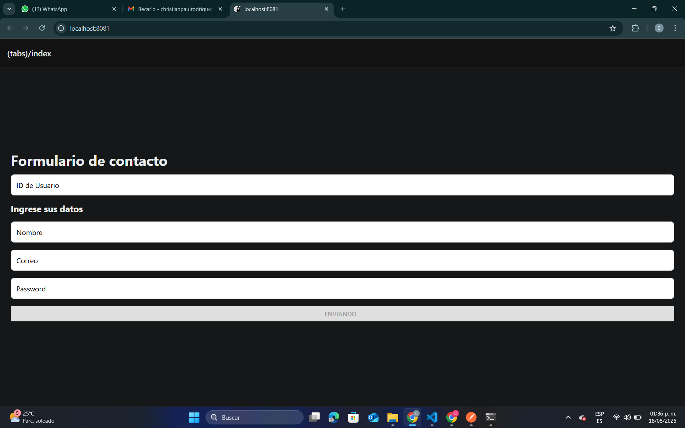
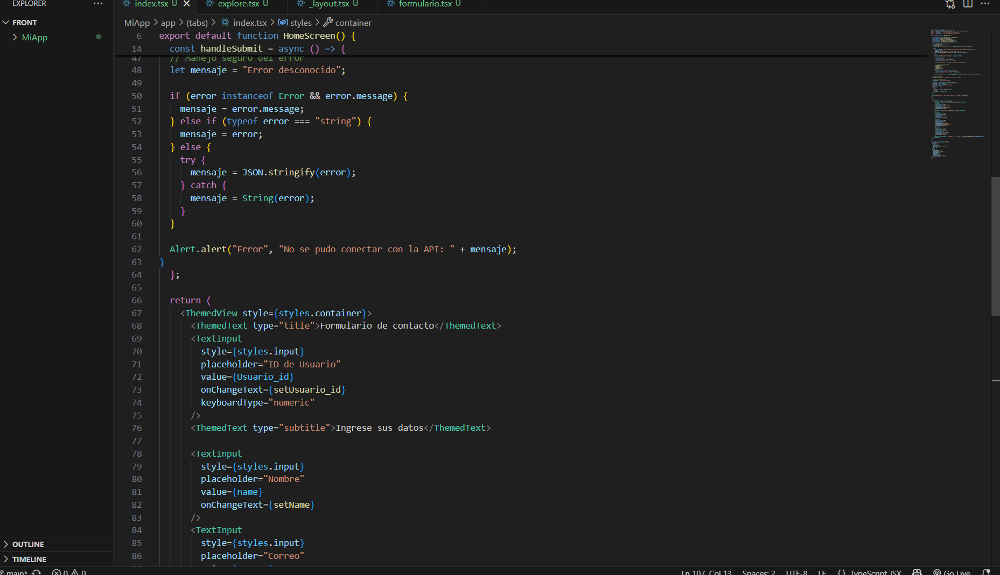
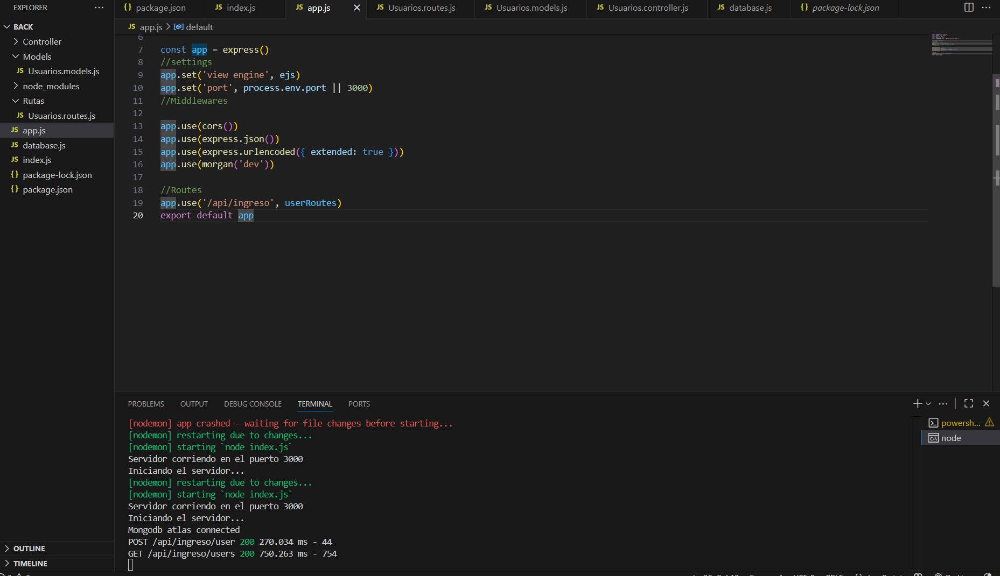

# 🚀 Postulación como Becario en **ROMI**

## 👨‍💻 Christian Paul Rodriguez Perez  

---

### 📌 Proyecto Propuesto
Este proyecto está dividido en **dos partes principales**:  

---

## 🔹 Backend: Node.js + MongoDB Atlas  
Se implementó un servidor en **Node.js** siguiendo el patrón **Modelo-Vista-Controlador (MVC)**, garantizando una estructura organizada y escalable.  

📂 **Estructura de carpetas:**
- **models/** → Definición de esquemas de datos.  
- **controllers/** → Lógica de negocio y validaciones.  
- **routes/** → Endpoints para interactuar con la API.  

🔗 **Conexión a la base de datos:**  
- **MongoDB Atlas**, una base de datos NoSQL en la nube.  
- Ideal para manejar grandes volúmenes de datos por minuto.  

📡 **Endpoints principales:**  
- `POST /api/ingreso/user` → Registrar un nuevo usuario.  
- `GET /api/ingreso/users` → Listar todos los usuarios registrados.  

---

## 🔹 Frontend: React Native  
Se desarrolló una **aplicación multiplataforma (iOS & Android)** con un diseño sencillo y funcional.  

📝 **Funcionalidades principales:**  
- Formulario clásico de registro de usuario.  
- Campos: `Usuario_id`, `name`, `correo`, `password`.  
- Conexión con el backend mediante **APIs REST**.  

⚡ **Características técnicas:**  
- Interfaz intuitiva.  
- Manejo de peticiones HTTP con **fetch/cors**.  
- Arquitectura limpia y fácil de mantener.  

---

## 🛠️ Tecnologías utilizadas  
| Área        | Tecnologías |
|-------------|-------------|
| **Backend** | Node.js, Express.js, MVC, MongoDB Atlas,nodemon,cors |
| **Frontend**| React Native  |
| **Otros**   | JavaScript , css|

---

## 📷 Vista del Proyecto (Mockup)

---

## 🙌 Conclusión  
Este proyecto demuestra la capacidad de integrar un **backend sólido** con un **frontend multiplataforma**, aplicando **buenas prácticas de desarrollo** y **tecnologías modernas**.  

✨ *Preparado para contribuir, aprender y crecer como becario en ROMI.* ✨
